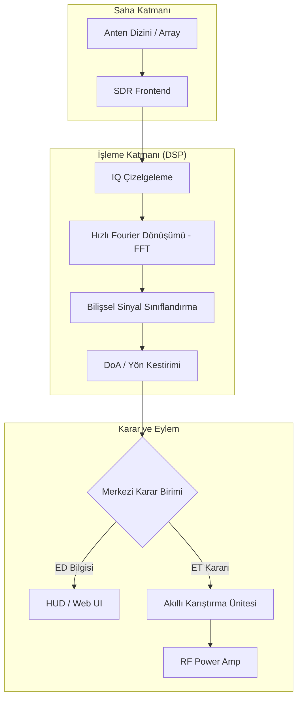

# 📡 E-Warfare-Nexus: Özel Taktik Spektrum Çözümü

[](https://teknofest.org)
[](https://aselsan.com.tr)
[]()
[]()


> [!IMPORTANT]
> **GİZLİDİR / PROPRIETARY & CONFIDENTIAL**
> Bu depo sadece yetkili görev personeli ve proje ekibi erişimi içindir. İçeriğin izinsiz paylaşılması veya kopyalanması kesinlikle yasaktır ve yasal sonuçlar doğuracaktır.

## 🌌 Proje Projeksiyonu
**E-Warfare-Nexus**, 2026 ASELSAN Elektronik Harp Yarışması operasyonları için geliştirilmiş **özel ve gizli** bir sistemdir. Bu ekosistem, otonom sistemlerin (İHA/İDA) elektromanyetik ortamdaki durumsal farkındalığını ve saldırı kabiliyetini maksimize etmek için takıma özel olarak optimize edilmiştir.

---

## 📑 Stratejik İçerik
- [🛠 Taktik Donanım Spesifikasyonu (Hardware Spec)](#-taktik-donanım-spesifikasyonu-hardware-spec)
- [🏗 Vizyon ve Bilişsel Strateji](#-vizyon-ve-bilişsel-strateji)
- [🛰 2026 Yarışma Ekosistemi (Derin Dosya)](#-2026-yarışma-ekosistemi-derin-dosya)
  - [Operasyonel Senaryolar](#operasyonel-senaryolar)
  - [Resmi Puanlama ve Performans Metrikleri](#resmi-puanlama-ve-performans-metrikleri)
- [🧬 Teknik Derinlik (Technical Deep Dive)](#-teknik-derinlik-technical-deep-dive)
  - [Bilişsel SIGINT & AI Modülasyon Tanıma](#bilişsel-sigint--ai-modülasyon-tanıma)
  - [Süper-Çözünürlüklü DoA (MUSIC & ESPRIT)](#süper-çözünürlüklü-doa-music--esprit)
  - [Taktik Drone EW & Remote-ID Protokolleri](#taktik-drone-ew--remote-id-protokolleri)
- [🏗 Sistem Mimarisi ve Veri Akışı](#-sistem-mimarisi-ve-veri-akışı)
- [📂 Modüler Altyapı](#-modüler-altyapı)
- [🚀 Kurulum ve Ar-Ge Başlangıç](#-kurulum-ve-ar-ge-başlangıç)
- [🗺 Stratejik Yol Haritası (v2.0 - 2027)](#-stratejik-yol-haritası-v20---2027)
- [📜 Referanslar ve Veri Setleri](#-referanslar-ve-veri-setleri)
- [🛡 Yasal Uyarı](#-yasal-uyarı)

---

## 🛠 Taktik Donanım Spesifikasyonu (Procurement & Engineering Level)

**E-Warfare-Nexus**, 2026 şartnamesindeki yüksek çözünürlüklü yön kestirimi, otonom AMC ve DRFM görevleri için aşağıdaki profesyonel donanım konfigürasyonunu temel alır. Donanım ekibi için satınalma (procurement) listesi:

### 1. Yazılım Tanımlı Radyo (SDR) Birimleri
| Birim | Marka / Model | Kritik Parametreler | Görev |
| :--- | :--- | :--- | :--- |
| **Coherent DF Receiver** | **KrakenSDR v2** | 5-Kanal Faz-Uyumlu, USB3.0, Korumalı Alüminyum Kasa | MUSIC DoA & Drone-ID Sniffing |
| **Geniş Bant SIGINT** | **Ettus USRP N321** | 200 MHz BW, 10 MHz - 6 GHz, LO Sharing | LPI Tespit & Karşı-Hopping Takibi |
| **Yüksek Güçlü EA** | **HackRF One + PortaPack H2** | 0.5ppm TCXO saat stabilitesi | GPS Spoofing & Reaktif Jamming |

### 2. Anten ve RF Ön-Uç (Front-End) Donanımı
*   **DF Anten Dizini (MUSIC/ESPRIT için)**:
    *   **Marka/Model**: *Aaronia HyperLOG 4060* (Log-Periodic) veya *Taoglas TG.30* (5-kanal UCA dizilimi için).
    *   **Yerleşim**: 5 adet dikey polarizasyonlu dipol anten, **Uniform Circular Array (UCA)** formunda, 2.4GHz merkez frekansı için tam olarak **62.5 mm yarıçaplı** dairesel düzleme monte edilmelidir.
*   **Geniş Bant İzleme**:
    *   **Marka/Model**: *Diamond Antenna D130J Discone*. (VHF/UHF/SHF menzili için en stabil omni-directional seçenek).
*   **RF Kablolama (Kritik - Faz Uyumu İçin)**:
    *   **Kablo**: **LMR-400 UltraFlex** (Bükülmeye dayanıklı, düşük kayıplı).
    *   **Konnektör**: *Amphenol SMA-Male Gold Plated*.
    *   **ÖNEMLİ**: DoA dizinindeki 5 kablo, VNA (Vector Network Analyzer) ile ölçülerek **elektriksel uzunluk bakımından <1° faz farkı** olacak şekilde eşlenmelidir.
*   **Sinyal Koşullandırma**:
    *   **LNA**: *Mini-Circuits ZX60-P103LN+* (+15dB Gain, ultra-low noise).
    *   **Filtreler**: *Mini-Circuits VBPF Serisi* (2.4 GHz ve 433 MHz bant-geçiren).

### 3. İşleme Birimi ve Saha Altyapısı
*   **Nexus Core (Yapay Zeka & DSP)**:
    *   **Modül**: **NVIDIA Jetson AGX Orin 64GB Developer Kit**.
    *   **Soğutma**: *Noctua NF-A4x10* aktif fanlı, endüstriyel tip IP67 muhafazalı soğutucu blok.
    *   **Taşıyıcı Board**: *Forecr DSBOX-AGX* (Sertifikalı EMI/EMC korumalı).
*   **Veri Depolama**: **Samsung 980 Pro 2TB NVMe M.2 SSD**. (1 GB/s sürekli IQ yazma kapasitesi için).
*   **Güç Sistemi**:
    *   **Batarya**: *LiFePO4 24V 40Ah* akıllı batarya paketi.
    *   **Konvertör**: *Vicor DC-DC Buck-Boost* (Stabilize 12V/19V/5V dağıtımı için).

---

## 🏗 Vizyon ve Bilişsel Strateji

Modern muharebe sahası artık sadece kinetik vuruşlardan ibaret değildir. E-Warfare-Nexus, ASELSAN'ın **PUHU**, **MİRKET** ve **KORAL** gibi sistemlerinden ilham alarak spektrumu bir "canlı organizma" gibi analiz eder.

> **Mantra**: "Tespit edilemeyeni tespit et, karıştırılamayanı karıştır."

---

## 🛰 2026 Yarışma Ekosistemi (Derin Dosya)

### Operasyonel Senaryolar
*   **1x1 km Aktif Saha**: 1000m x 1000m'lik operasyon alanında drone tabanlı mobil hedeflerin takibi.
*   **Hedef Sinyal Seti**: 
    - FHSS (Frequency Hopping Spread Spectrum) telsiz hatları.
    - LoRa ve FSK tabanlı düşük güçlü geniş alan ağı (LPWAN) sensörleri.
    - Drone-ID (Remote-ID) yayınları (Wi-Fi/Bluetooth tabanlı dijital plaka).
*   **Gürültü ve Karıştırma Altında Çalışma**: AWGN (Additive White Gaussian Noise) ve aktif aktif karıştırma ortamında sinyal çıkarımı.

### Resmi Puanlama ve Performans Metrikleri
`Puan_Total = (KTR * 0.15) + (STV * 0.15) + (Görev_Skoru * 0.70)`

*   **Görev Skoru Kriterleri**:
    - **Algılama Latansı**: Sinyal başladığı andan itibaren <500ms'de tespit (Tam puan).
    - **DoA Doğruluğu**: Hata RMS < 2° (MUSIC Algoritması ile).
    - **JSR Optimizasyonu**: Hedef haberleşmesini kesmek için gereken minimum RF çıkış gücü.

---

## 🧬 Teknik Derinlik (Technical Deep Dive)

### Bilişsel SIGINT & AI Modülasyon Tanıma
Geleneksel enerji tespiti yöntemleri düşük SNR değerlerinde başarısız olur. E-Warfare-Nexus, **DeepSig RadioML 2018.01A** veri setinde eğitilmiş **CNN-ResNet** ve **Transformer** modellerini kullanır.
*   **Otonom Tanıma**: 24 farklı modülasyon tipini (QPSK, 16QAM, BPSK vb.) %90+ doğrulukla sınıflandırır.
*   **Denoising Autoencoders**: Gürültülü sinyalleri AI ile temizleyerek parametre çıkarımını kolaylaştırır.

### Süper-Çözünürlüklü DoA (MUSIC & ESPRIT)
Sinyal yönünü bulmak için sadece genlik farkına bakmak yetersizdir.
*   **MUSIC (Multiple Signal Classification)**: Gürültü ve sinyal alt-uzaylarını ayrıştırarak anten dizinindeki faz farklarından süper-çözünürlüklü yön kestirimi yapar.
*   **ESPRIT**: Rotasyonel değişmezlik özelliği ile MUSIC' lere göre daha hızlı ve düşük hesaplama maliyetli alternatif sunar.
*   **KrakenSDR Entegrasyonu**: 5 kanallı faz-uyumlu (coherent) alıcı seti ile interferometrik ölçüm.

### Taktik Drone EW & Remote-ID Protokolleri
*   **Remote-ID Analizi**: Drone'ların yaydığı dijital plaka verilerini (Seri No, Konum, İrtifa) Wi-Fi/Bluetooth protokolleri üzerinden çözer.
*   **Look-through (Arabakış)**: Jammer aktifken mikrosaniye seviyesinde sessizlik pencereleri açarak spektrumu dinlemeye devam eder.

---

## 🏗 Sistem Mimarisi ve Veri Akışı (v2.0)



---

## 📂 Modüler Altyapı (v2.0)

*   **`nexus_control.py`**: **Ana Kontrol Birimi.** Tüm sistemi senaryo bazlı veya SDR canlı modda yöneten merkezi loop.
*   **`src/ai_engine/`**: 
    - `classifier.py`: Kural tabanlı ve AI hibrit sınıflandırma.
    - `autonomy_manager.py`: Otonom strateji belirleme ve risk analizi.
*   **`src/signal_processing/`**:
    - `doa_estimator.py`: **[YENİ]** MUSIC ve ESPRIT algoritmaları ile yön kestirimi.
    - `lpi_detector.py`: Düşük yakalanma olasılıklı radar tespiti.
    - `analyzer.py`: Parametre çıkarımı (PRI, PW, BW).
*   **`src/jamming_logic/`**:
    - `jammers.py`: Akıllı karıştırma, DRFM ve reaktif jamming algoritmaları.
    - `spoofers.py`: **[YENİ]** GNSS/GPS yanıltma (spoofing) arayüzü.
*   **`src/simulation/`**: Şartnameye uygun test senaryoları ve sentetik sinyal üreteci.

---

## 🚀 Kurulum ve Çalıştırma

### Geliştirici Ortamı
```bash
# Bağımlılıkları yükle
pip install -r requirements_competition.txt

# Ana sistemi başlat (Simülasyon Modu)
python nexus_control.py

# Şartname doğrulama testini çalıştır
python verify_eh.py
```
```

---

## 🗺 Stratejik Yol Haritası (v2.0 - 2027)

- [ ] **AI-Driven Jamming**: Karşı tarafın anti-jamming (hopping) desenini öğrenen sinir ağları.
- [ ] **Multi-Static Localization**: 3 ve daha fazla otonom sistemin birbirleriyle veri paylaşarak TDOA ile konum bulması.
- [ ] **Quantum-Resistant RF Crypto**: Spektrumdaki kriptolu haberleşmeyi analiz eden ileri modüller.

---

## 📜 Referanslar ve Veri Setleri
1.  **RadioML 2018.01A**: DeepSig Inc. tarafından sağlanan modülasyon veri seti.
2.  **Schmidt, R.**: "Multiple Signal Classification (MUSIC) Algorithm", 1986.
3.  **ASELSAN PUHU**: Milli Pasif Kestirim ve Yön Bulma Sistemi (Vizyon İlhamı).

---

## 🔐 Erişim ve Gizlilik (Team Only)

Bu repo açık kaynaklı **değildir**. Geliştirme ve operasyon süreçleri sadece aşağıdaki kurallara göre yürütülür:
*   **İzinli Erişim**: Sadece takım listesinde yer alan personelin erişim yetkisi vardır.
*   **Veri Gizliliği**: IQ kayıtları ve saha test verileri asla ortak sunuculara yüklenemez.
*   **Kod Güvenliği**: Modüller üzerinde yapılan değişiklikler kod gözden geçirme (code review) sonrası ana dallara birleştirilir.

---

## 🛡 Yasal ve Disiplin Uyarısı

> [!CAUTION]
> Bu proje tamamen savunma sanayii yarışma simülasyonları ve operasyonel hazırlık için tasarlanmış **mülkiyet haklı** bir çalışmadır. İzinsiz paylaşım, 5237 Sayılı TCK'nın ilgili maddeleri ve takım içi gizlilik sözleşmeleri uyarınca suç teşkil eder.

---

<p align="center">
  <b>Built for Defense, Designed for Excellence.</b><br>
  <i>"Spektruma hükmeden, geleceğe hükmeder."</i>
</p>
po sadece akademik ve yarışma simülasyonları için tasarlanmıştır.

---

<p align="center">
  <b>ASELSAN 2026 Yarışma Şartnamesine Tam Uyumludur</b><br>
  <i>"Spektruma hükmeden, geleceğe hükmeder."</i>
</p>

