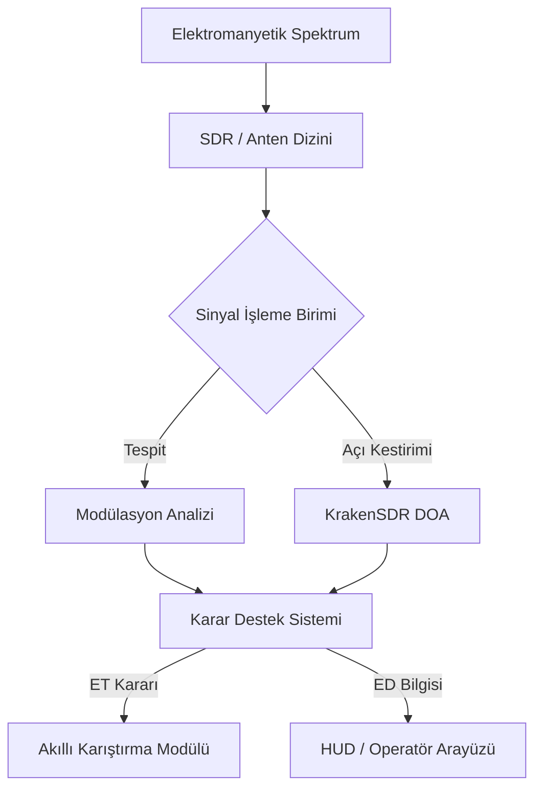

# E-Warfare-Nexus: 2026 Elektronik Harp Stratejik Platformu


## 📡 Proje Vizyonu
**E-Warfare-Nexus**, 2026 Teknofest Elektronik Harp Yarışması şartnamesine tam uyumlu, modern sinyal istihbaratı (SIGINT), elektronik destek (ED) ve elektronik saldırı (ET) algoritmalarını bünyesinde barındıran ileri seviye bir geliştirme platformudur. Proje; otonom sistemlerin elektromanyetik spektrumda hayatta kalmasını ve üstünlük kurmasını sağlayacak "akıllı" spektrum kontrol mekanizmalarına odaklanır.

---

## 🛠 2026 Elektronik Harp Şartnamesi & Hedefler
2026 yılı teknik gereksinimleri ve ASELSAN yürütücülüğündeki vizyon doğrultusunda projenin temel yetkinlik alanları:

### 1. Sinyal Algılama ve Spektrum Analizi
*   **Geniş Bant Tarama**: Çok kanallı SDR altyapısı ile spektrumun anlık izlenmesi.
*   **Modülasyon Tanıma**: Derin öğrenme tabanlı otomatik modülasyon sınıflandırma (AMC).
*   **LPI/LPD Tespiti**: Düşük yakalanma olasılıklı sinyallerin (Frequency Hopping vb.) gerçek zamanlı analizi.

### 2. Yön ve Konum Belirleme (DF & Localization)
*   **KrakenSDR Entegrasyonu**: 5 kanallı faz uyumlu alıcı seti ile interferometrik yön kestirimi.
*   **DoA Algoritmaları**: MUSIC (Multiple Signal Classification) ve Root-MUSIC algoritmaları ile yüksek hassasiyetli açı takibi.

### 3. Elektronik Taarruz (Jamming & Deception)
*   **Akıllı Karıştırma**: Hedef sinyal protokolüne özel (Barrage, Spot, Sweep) karıştırma teknikleri.
*   **GNSS Spoofing Koruması**: Sahte GPS sinyallerini filtreleme ve otonom navigasyon güvenliği.

---

## 📂 Çekirdek Modüller

| Modül | Açıklama | Teknoloji |
| :--- | :--- | :--- |
| `gnuradio` | DSP akış şemaları ve sinyal işleme blokları. | Python, C++, GRC |
| `krakensdr_doa` | Çok kanallı yön kestirim ve hüzmeleme (beamforming) katmanı. | C++, KrakenSDR API |
| `hackasat-final-2021` | Uydu haberleşmesi ve siber-fiziksel harp senaryoları. | Linux, Zynq, Aerospace |

---

## 🏗 Teknik Mimari



---

## 🚀 Başlangıç

### Gereksinimler
- **Hardware**: RTL-SDR, HackRF veya KrakenSDR.
- **Software**: GNU Radio v3.10+, Python 3.9+, Docker.

### Kurulum
```bash
git clone https://github.com/bahattinyunus/E-Warfare-Nexus.git
cd E-Warfare-Nexus
# GNURadio modüllerini derle
cd gnuradio && make build
```

---

## 🛡 Güvenlik ve Uyarı
Bu proje tamamen eğitim ve yarışma amaçlı geliştirilmiştir. Elektromanyetik spektrumda izinsiz yayın yapmak yasal sorumluluk doğurabilir. Kullanıcılar yerel spektrum yasalarına (BTK vb.) uymakla yükümlüdür.

---

**"Spektruma hükmeden, geleceğe hükmeder."**

