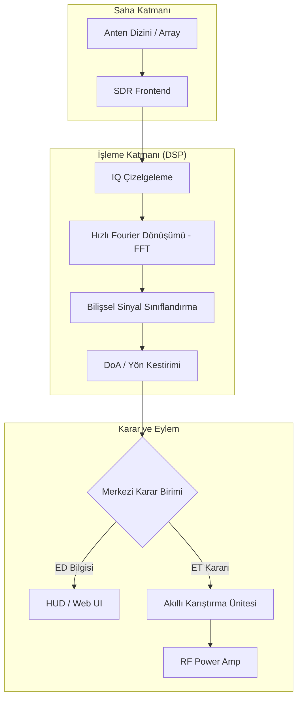

# 📡 E-Warfare-Nexus: İleri Nesil Spektrum Domine Sistemi

[](https://teknofest.org)
[](https://aselsan.com.tr)
[]()
[]()


## 🌌 Proje Projeksiyonu
**E-Warfare-Nexus**, 2026 ASELSAN Elektronik Harp Yarışması şartnamesine tam uyumlu; sadece bir yazılım kütüphanesi değil, **Bilişsel Spektrum Üstünlüğü** sağlamayı hedefleyen bir ekosistemdir. Proje, otonom sistemlerin (İHA/İDA) elektromanyetik ortamdaki durumsal farkındalığını en üst düzeye çıkarmak için tasarlanmıştır.

---

## 📑 Stratejik İçerik
- [🏗 Vizyon ve Bilişsel Strateji](#-vizyon-ve-bilişsel-strateji)
- [🛰 2026 Yarışma Ekosistemi (Derin Dosya)](#-2026-yarışma-ekosistemi-derin-dosya)
  - [Operasyonel Senaryolar](#operasyonel-senaryolar)
  - [Resmi Puanlama ve Performans Metrikleri](#resmi-puanlama-ve-performans-metrikleri)
- [🧬 Teknik Derinlik (Technical Deep Dive)](#-teknik-derinlik-technical-deep-dive)
  - [Bilişsel SIGINT & AI Modülasyon Tanıma](#bilişsel-sigint--ai-modülasyon-tanıma)
  - [Süper-Çözünürlüklü DoA (MUSIC & ESPRIT)](#süper-çözünürlüklü-doa-music--esprit)
  - [Taktik Drone EW & Remote-ID Protokolleri](#taktik-drone-ew--remote-id-protokolleri)
- [🏗 Sistem Mimarisi ve Veri Akışı](#-sistem-mimarisi-ve-veri-akışı)
- [📂 Modüler Altyapı](#-modüler-altyapı)
- [🚀 Kurulum ve Ar-Ge Başlangıç](#-kurulum-ve-ar-ge-başlangıç)
- [🗺 Stratejik Yol Haritası (v2.0 - 2027)](#-stratejik-yol-haritası-v20---2027)
- [📜 Referanslar ve Veri Setleri](#-referanslar-ve-veri-setleri)
- [🛡 Yasal Uyarı](#-yasal-uyarı)

---

## 🏗 Vizyon ve Bilişsel Strateji

Modern muharebe sahası artık sadece kinetik vuruşlardan ibaret değildir. E-Warfare-Nexus, ASELSAN'ın **PUHU**, **MİRKET** ve **KORAL** gibi sistemlerinden ilham alarak spektrumu bir "canlı organizma" gibi analiz eder.

> **Mantra**: "Tespit edilemeyeni tespit et, karıştırılamayanı karıştır."

---

## 🛰 2026 Yarışma Ekosistemi (Derin Dosya)

### Operasyonel Senaryolar
*   **1x1 km Aktif Saha**: 1000m x 1000m'lik operasyon alanında drone tabanlı mobil hedeflerin takibi.
*   **Hedef Sinyal Seti**: 
    - FHSS (Frequency Hopping Spread Spectrum) telsiz hatları.
    - LoRa ve FSK tabanlı düşük güçlü geniş alan ağı (LPWAN) sensörleri.
    - Drone-ID (Remote-ID) yayınları (Wi-Fi/Bluetooth tabanlı dijital plaka).
*   **Gürültü ve Karıştırma Altında Çalışma**: AWGN (Additive White Gaussian Noise) ve aktif aktif karıştırma ortamında sinyal çıkarımı.

### Resmi Puanlama ve Performans Metrikleri
`Puan_Total = (KTR * 0.15) + (STV * 0.15) + (Görev_Skoru * 0.70)`

*   **Görev Skoru Kriterleri**:
    - **Algılama Latansı**: Sinyal başladığı andan itibaren <500ms'de tespit (Tam puan).
    - **DoA Doğruluğu**: Hata RMS < 2° (MUSIC Algoritması ile).
    - **JSR Optimizasyonu**: Hedef haberleşmesini kesmek için gereken minimum RF çıkış gücü.

---

## 🧬 Teknik Derinlik (Technical Deep Dive)

### Bilişsel SIGINT & AI Modülasyon Tanıma
Geleneksel enerji tespiti yöntemleri düşük SNR değerlerinde başarısız olur. E-Warfare-Nexus, **DeepSig RadioML 2018.01A** veri setinde eğitilmiş **CNN-ResNet** ve **Transformer** modellerini kullanır.
*   **Otonom Tanıma**: 24 farklı modülasyon tipini (QPSK, 16QAM, BPSK vb.) %90+ doğrulukla sınıflandırır.
*   **Denoising Autoencoders**: Gürültülü sinyalleri AI ile temizleyerek parametre çıkarımını kolaylaştırır.

### Süper-Çözünürlüklü DoA (MUSIC & ESPRIT)
Sinyal yönünü bulmak için sadece genlik farkına bakmak yetersizdir.
*   **MUSIC (Multiple Signal Classification)**: Gürültü ve sinyal alt-uzaylarını ayrıştırarak anten dizinindeki faz farklarından süper-çözünürlüklü yön kestirimi yapar.
*   **ESPRIT**: Rotasyonel değişmezlik özelliği ile MUSIC' lere göre daha hızlı ve düşük hesaplama maliyetli alternatif sunar.
*   **KrakenSDR Entegrasyonu**: 5 kanallı faz-uyumlu (coherent) alıcı seti ile interferometrik ölçüm.

### Taktik Drone EW & Remote-ID Protokolleri
*   **Remote-ID Analizi**: Drone'ların yaydığı dijital plaka verilerini (Seri No, Konum, İrtifa) Wi-Fi/Bluetooth protokolleri üzerinden çözer.
*   **Look-through (Arabakış)**: Jammer aktifken mikrosaniye seviyesinde sessizlik pencereleri açarak spektrumu dinlemeye devam eder.

---

## 🏗 Sistem Mimarisi ve Veri Akışı (v2.0)



---

## 📂 Modüler Altyapı (v2.0)

*   **`nexus_control.py`**: **Ana Kontrol Birimi.** Tüm sistemi senaryo bazlı veya SDR canlı modda yöneten merkezi loop.
*   **`src/ai_engine/`**: 
    - `classifier.py`: Kural tabanlı ve AI hibrit sınıflandırma.
    - `autonomy_manager.py`: Otonom strateji belirleme ve risk analizi.
*   **`src/signal_processing/`**:
    - `doa_estimator.py`: **[YENİ]** MUSIC ve ESPRIT algoritmaları ile yön kestirimi.
    - `lpi_detector.py`: Düşük yakalanma olasılıklı radar tespiti.
    - `analyzer.py`: Parametre çıkarımı (PRI, PW, BW).
*   **`src/jamming_logic/`**:
    - `jammers.py`: Akıllı karıştırma, DRFM ve reaktif jamming algoritmaları.
    - `spoofers.py`: **[YENİ]** GNSS/GPS yanıltma (spoofing) arayüzü.
*   **`src/simulation/`**: Şartnameye uygun test senaryoları ve sentetik sinyal üreteci.

---

## 🚀 Kurulum ve Çalıştırma

### Geliştirici Ortamı
```bash
# Bağımlılıkları yükle
pip install -r requirements_competition.txt

# Ana sistemi başlat (Simülasyon Modu)
python nexus_control.py

# Şartname doğrulama testini çalıştır
python verify_eh.py
```
```

---

## 🗺 Stratejik Yol Haritası (v2.0 - 2027)

- [ ] **AI-Driven Jamming**: Karşı tarafın anti-jamming (hopping) desenini öğrenen sinir ağları.
- [ ] **Multi-Static Localization**: 3 ve daha fazla otonom sistemin birbirleriyle veri paylaşarak TDOA ile konum bulması.
- [ ] **Quantum-Resistant RF Crypto**: Spektrumdaki kriptolu haberleşmeyi analiz eden ileri modüller.

---

## 📜 Referanslar ve Veri Setleri
1.  **RadioML 2018.01A**: DeepSig Inc. tarafından sağlanan modülasyon veri seti.
2.  **Schmidt, R.**: "Multiple Signal Classification (MUSIC) Algorithm", 1986.
3.  **ASELSAN PUHU**: Milli Pasif Kestirim ve Yön Bulma Sistemi (Vizyon İlhamı).

---

## 🛡 Yasal Uyarı

> [!IMPORTANT]
> Bu proje tamamen eğitim ve savunma sanayii yarışma simülasyonları için geliştirilmiştir. İzinsiz RF yayını yapmak BTK ve ilgili kanunlarca (5809 sayılı Elektronik Haberleşme Kanunu) yasaktır. Lütfen yasal limitlerde (ISM bantları vb.) kalınız.

---

<p align="center">
  <b>Built for Defense, Designed for Excellence.</b><br>
  <i>"Spektruma hükmeden, geleceğe hükmeder."</i>
</p>
po sadece akademik ve yarışma simülasyonları için tasarlanmıştır.

---

<p align="center">
  <b>ASELSAN 2026 Yarışma Şartnamesine Tam Uyumludur</b><br>
  <i>"Spektruma hükmeden, geleceğe hükmeder."</i>
</p>

